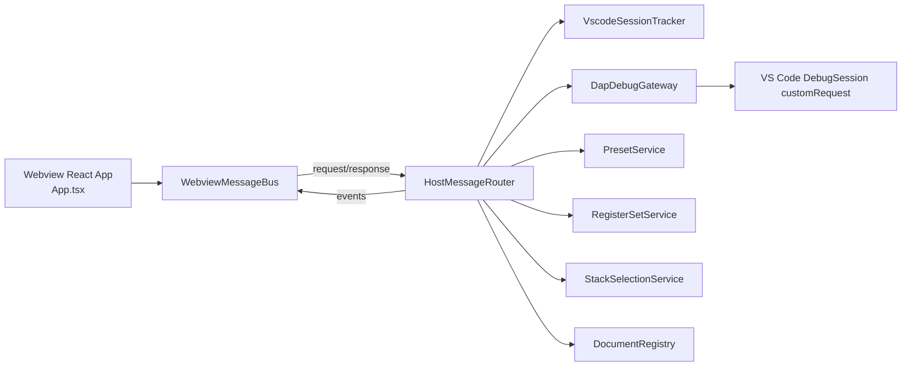
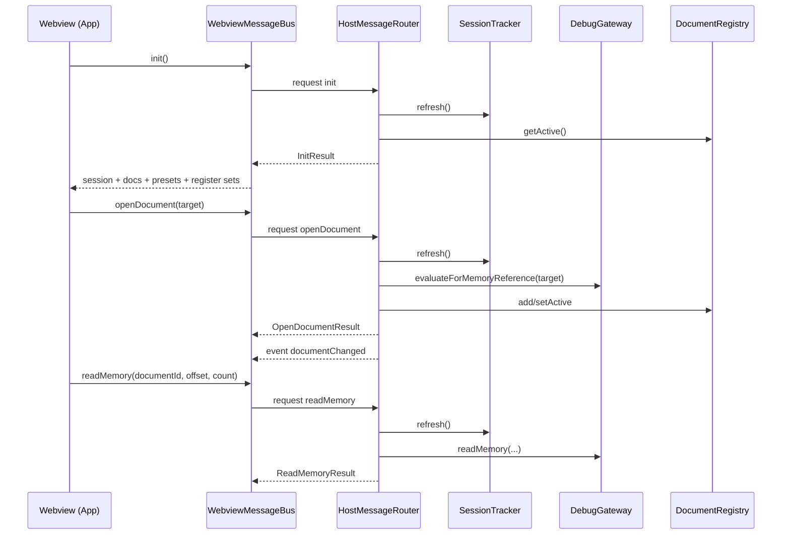

# Architecture

This architecture description is derived from the current repository code.

## Layered structure

- `Host` (`src/host/*`): VS Code integration and message routing.
- `Debug` (`src/debug/*`): debugger-facing contracts and DAP implementation.
- `Domain` (`src/domain/*`): pure TypeScript models and validation.
- `Protocol` (`src/protocol/*`): typed method/event/error contracts.
- `Webview` (`src/webview/*`): React UI and client-side state.

## Runtime component map

## Activation and composition

### Entry points

- `src/extension.ts` exports `activate` and `deactivate` from `src/host/activate.ts`.

### Activation

`src/host/activate.ts`:

- creates services via `createHostServices`
- registers `MemoryViewProvider` for panel view
- registers three commands
- sets cleanup disposables for tracker/provider

### Composition root

`src/host/composition/createHostServices.ts` wires:

- `VscodeSessionTracker`
- `DapDebugGateway`
- `DocumentRegistry`
- `PresetService`
- `RegisterSetService`
- `StackSelectionService`
- `HostMessageRouter`
- `MemoryViewProvider`

## Data flow

## Session state handling

`VscodeSessionTracker` uses multiple sources:

- `onDidStartDebugSession`
- `onDidTerminateDebugSession`
- `onDidReceiveDebugSessionCustomEvent`
- `onDidChangeActiveStackItem`
- `onDidChangeActiveDebugSession`

It also probes session status using `threads` and `stackTrace` in `probeSessionState`.

## Webview/provider model

- Panel view provider: `src/host/providers/MemoryViewProvider.ts`
- Editor-tab command also creates a `WebviewPanel` with same bundled `dist/webview.js`.
- The bundle can render memory or unified debug-navigation views based on the injected webview kind.
- Router attach/detach is called on disposal/visibility transitions.
