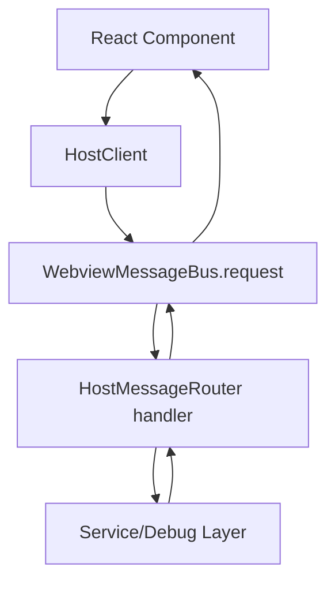

# Protocol and Host API

StackScope uses a typed request/response/event protocol between webview and host.

## Message envelopes

Defined in `src/protocol/messages.ts`.

- Request: `type: 'request'`, `id`, `method`, `params`
- Response success: `type: 'response'`, `id`, `success: true`, `result`
- Response error: `type: 'response'`, `id`, `success: false`, `error`
- Event: `type: 'event'`, `event`, `payload`

## Method contracts

Defined in `src/protocol/methods.ts` (`MethodMap`).

### Session/document methods

- `init`
- `openDocument`
- `readMemory`

### Preset methods

- `listPresets`
- `savePreset`
- `deletePreset`

### Register-set methods

- `listRegisterSets`
- `saveRegisterSet`
- `updateRegisterSet`
- `deleteRegisterSet`
- `selectRegisterSet`
- `readRegisters`

## Event contracts

Defined in `src/protocol/events.ts`:

- `sessionChanged`
- `documentChanged`

## Error model

Defined in `src/protocol/errors.ts`:

- `NO_ACTIVE_SESSION`
- `SESSION_NOT_STOPPED`
- `READ_MEMORY_FAILED`
- `INVALID_ADDRESS`
- `DOCUMENT_NOT_FOUND`
- `SYMBOL_NOT_FOUND`
- `REGISTER_NOT_AVAILABLE`
- `UNKNOWN_ERROR`

## Host-side handler implementation

Handlers are implemented in `src/host/bridge/HostMessageRouter.ts`.

Notable behavior:

- `init` returns session + active doc + presets + register sets + selected register set id.
- `openDocument` requires stopped session and creates immutable `MemoryDocument`.
- `readMemory` requires stopped session and re-resolves dynamic targets.
- `readRegisters` requires stopped session and maps results to register set entries.

## Webview client bindings

`src/webview/rpc/HostClient.ts` is the typed API used by React components.

`src/webview/rpc/WebviewMessageBus.ts` handles request correlation and event dispatch.

## Flow summary

